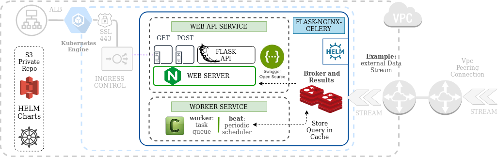
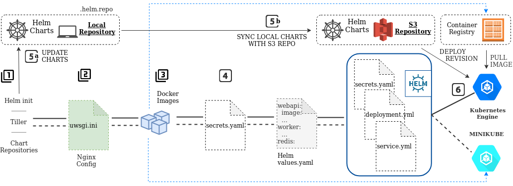

# Flask-Nginx-Base-Api

This project is a blue print for building any Rest API project using Flask and Nginx.
It is assuming a K8s deployment in an AWS Kops cluster using Helm.

---

## Project Design

**Graph 1: Component Topology**

 

Find the respective web app components labeled with the green text boxes as directories 
in the code base. The component in the blueish text box refers to the name of the 
directory containing the custom Helm Chart. 

---

**Graph 2: Conceptual Deployment Workflow**



- [Step 1: Initialize Minikube](#step-1:-initialize-minikube)
- [Step 2: Set Up Python Webserver](#step-2:-set-up-python-webserver)
- [Step 3: Provide Docker Images](#step-3:-provide-docker-images)
- [Step 4: Prepare for the Helm Deployment](#step-4:-prepare-for-the-helm-deployment)
- [Step 5: Sync the Helm Repository](#step-5:-sync-the-helm-repository)
- [Step 6: Deploy Helm Chart](#step-6:-deploy-helm-chart)

## Prerequisites

For local development, the following components are required on the local machine:

+ Pipenv
+ Python Version 3.6
+ Docker installed [official Docker docs](https://docs.docker.com/)
+ Minikube [https://kubernetes.io/docs/tasks/tools/install-minikube/](https://kubernetes.io/docs/tasks/tools/install-minikube/)
+ Helm v2 [https://helm.sh/docs/](https://helm.sh/docs/)
+ [Optionally] Skaffold [https://skaffold.dev/docs/](https://skaffold.dev/docs/) - NOTE: Skaffold currently only supports helm v2

---

## Quickstart Development Minikube

Develop this project in Kubernetes on Minikube. For latter there is a development tool 
called *Skaffold*, which detects changes and redeploys Docker images automatically.

If you are running Helm for the first time in your account, see [1. Initialize Helm S3 Repo](#1.-initialize-helm-s3-epo) 
for further instructions.


### Step 1: Initialize Minikube

Initialize minikube and Tiller for local development:
```
# Always ensure that kubectl versions are matching
$ minikube start -p local-minikube --vm-driver kvm2 --memory 4096 --cpus 2 --disk-size='40000mb' --kubernetes-version v1.17.0

# Install Tiller (Helm v2) - Ensure that the correct kube-ctl context is selected
$ helm init --history-max 200

$ helm --debug serve --address 127.0.0.1:8879 --repo-path $(pwd)/.helm-repo

# Confirm local repo
$ helm search local
$ tree -L 3 ~/.helm/

```

### Step 2: Set Up Python Webserver

Create UWSGI config in `webapiservice/` create file `uwsgi.ini`:
```
[uwsgi]
socket = /tmp/uwsgi.sock
chown-socket = nginx:nginx
chmod-socket = 664
# Graceful shutdown on SIGTERM, see https://github.com/unbit/uwsgi/issues/849#issuecomment-118869386
hook-master-start = unix_signal:15 gracefully_kill_them_all
need-app = true
die-on-term = true
# For debugging and testing
show-config = true

module = flaskapi.api
callable = create_app()

```

### Step 3: Provide Docker Images

#### i. Create Python requirements

1. In `webapiservice` run: `pipenv lock -r > requirements.txt`
2. In `workerservice` run: `pipenv lock -r > requirements.txt`


#### ii. Build Images

Docker images need to be present inside minikube dockerd:
```
$ eval $(minikube -p local-minikube docker-env)

$ docker build -t local/webapiservice:0.0 ./webapiservice

$ docker build -t local/workerservice:0.0 ./workerservice

```

### Step 4: Prepare For The Helm Deployment

#### i. Create Helm secrets

It is best practise to NOT version secrets and manually remove them after the Helm 
deployment.

In `flask-nginx-celery/templates/` add the following `secrets.yaml` file:
```
apiVersion: v1
kind: Secret
metadata:
  name: {{ include "basechart.name" . }}
  labels:
    app.kubernetes.io/name: {{ include "basechart.name" . }}
    helm.sh/chart: {{ include "basechart.chart" . }}
    app.kubernetes.io/instance: {{ .Release.Name }}
    app.kubernetes.io/managed-by: {{ .Release.Service }}
type: Opaque
data:
  {{- range $index, $index_value := .Values.secretValues }}
  {{ $index }}: {{ $index_value | b64enc | quote }}
  {{- end }}


```

#### ii. Provide default values

**NOTE:** It is recommended to match the `values.yaml` with a `values-stage.yaml`. In any case the
`values.yaml` corresponds to the "fall-back" or *default* configuration.

Provide values for deploying `flask-nginx-celery`. This is an example for a development `values.yaml`
file:
```
secretValues:
  FLASKAPP_FERNET_KEY: "56cat%beti0-4z)4%wy*i#8bes3*yumm1i!_rx^r@vimzwo7@1"

webapi:
  replicaCount: 1
  image: local/webapiservice:0.2
  initContainerImage: "alpine:3.6"
  pullPolicy: IfNotPresent
  extraArgs:
    - "/usr/bin/supervisord"
  service:
    type: NodePort
    name: webapiservice
    externalPort: 5000
    internalPort: 5000
  ingress:
    enabled: false
    ...
  resources: {}
  
redis:
  enabled: true
  image:
    registry: docker.io
    repository: bitnami/redis
    ...
  
postgresql:
  enabled: false

```

### Step 5: Sync The Helm Repository

#### i. Add the Helm Repo

**NOTE:** This private Helm repository is for self-hosting your own Helm charts via S3.
For informations on how to set up a remote S3 Helm repo follow the section in
[General Instructions](#1.-initialize-helm-s3-repo).

**NOTE:** All instances of *my_organization* in `Makefile` and `flask-nginx-celery/requirements.txt`
need to be replaced accordingly.

```
$ AWS_PROFILE=my_profile helm repo add my_organization s3://my_organization-helmchart-001-repo-eu-central-1/charts

```

#### ii. Fetch Helm subcharts and package

```
# Fetch redis and other depending charts accordingly
$ helm fetch --untar -d flask-nginx-celery/charts/ stable/redis

```

**NOTE:** Copy the dependency chart `*.tgz` packages manually into the local `.helm-repo`.
Sync them via `make charts` and repeat until all charts are synced.


#### iii. Push local Helm charts to remote repository

**NOTE:** Ensure that Helm S3 Repository is initialized and your local requirements are 
present in the charts folder

```
$ AWS_PROFILE=my_profile make charts         <= This is save to run any number of times!

```

### Step 6: Deploy Helm Chart

#### i. Directly via Helm

```
$ AWS_PROFILE=my_profile make helm-target

$ minikube -p local-minikube ip           <= minikube_ip
$ kubectl get all       <= node_port

```

Open the Flaskapi via browser at `https://<minikube_ip>:<node_port>`

#### ii. Skaffold for interactive Development

**NOTE:** Skaffold will need access to a private Docker Registry. See below in the
[Production Deployment](#2.-docker-images) for instructions.

```
$ AWS_PROFILE=<my_profile> skaffold dev --default-repo <ecr_S3_repo> --kube-context local-minikube

```

---


## Testing

### i. Define Testing Environment

**NOTE:** The testing environment is very close to staging except that the webservice will
not be started automatically, as pytest will build the clients, and all `*-deployment` 
containers are running in *keep-alive* mode.

Create `flask-nginx-celery/values-dev.yaml`
```
envValues:
  PYTHONPATH: "/usr/src/queue"

webapi:
  replicaCount: 1
  image: local/webapiservice:0.3
  initContainerImage: "alpine:3.6"
  pullPolicy: IfNotPresent
  nameOverride: baseapi-flask
  # -c will tell supervisord to start an alternative supervisord.conf, which
  # in this case will just keep the docker alive instead of running nginx
  extraArgs:
    - "/usr/bin/supervisord"
    - -c
    - /usr/src/app/supervisord-dev.conf
...

scheduler:
  ...
  extraArgs:
    - /usr/src/queue/scripts/keep-alive.sh
    
worker:
  ...
  extraArgs:
    - "/usr/bin/supervisord"
    - -c
    - /usr/src/queue/supervisord-dev.conf
    
beat:
  ...
  extraArgs:
    - /usr/src/queue/scripts/keep-alive.sh


```

### ii. Lauch Testing Environment

See [Step 6: Deploy Helm Chart](#step-6:-deploy-helm-chart). Ensure that `values-dev.yaml` is selected.
Using *Skaffold* this is the default option.

### iii. Run the Tests

**NOTE:** Inside `workerservice` ensure that `PYTHONPATH=/usr/src/queue` is set.

Execute the tests for the `webapiservice` and the `workerservice` respectively:
```
# WEBAPISERVICE
$ kubectl -n olmax-baseapi-0-0-1 exec baseapi-flask-6dff8fdbc6-44njz -- pytest


# WORKERSERVICE
$ kubectl -n skaffold exec -ti baseapi-flask-worker-7667dd74c9-t6k4v -- python -m pytest /usr/src/queue/

```


---

## Production Deployment

There is no difference between deploying into a local Minikube instance and a production 
cluster. However, there are additional steps partially replacing the above mentioned.

Ensure that Helm is initialized with the correct target `kubectl`.

### 1. Initialize Helm

Helm is dependent on the `kubectl` configuration, and therefore in the production 
environment this needs to be done on the cluster side.

Activate Helm repository `local`:
```
$ helm --debug serve --address 127.0.0.1:8879 --repo-path $(pwd)/.helm-repo

```

### 2. Docker Images

The container repository needs to be made available on the cluster side. Build the 
Docker images and push them to the private container repository. 

```
# LOGIN AND PUSH IMAGE
$ $(aws ecr --profile <your_profile> get-login --no-include-email --region eu-central-1)
$ aws ecr --profile <your_profile> create-repository --repository-name nginx

$ docker push ****.dkr.ecr.eu-central-1.amazonaws.com/nginx:1.17.1

```

### 3. - 4. Follow the Steps from Quickstart Deployment

See above.

### 5. Expose Services to External Traffic

Follow along with the instructions for the `values.yaml` file in the section *Quickstart*
*Deployment*. The following instructions relate to the `flask-nginx-celery/templates/service.yaml`.

In a production cluster, there are two ways of exposing the app to external traffic:
1. Built-in Service `type: LoadBalancer`
2. Through an Ingress Controller 


#### i. Expose Service Through Built-In LoadBalancer 

In `flask-nginx-celery/values.yaml` change:
```
service:
    type: LoadBalancer    # ONLY USE WITH ingress.enabled: false
    name: webapiservice
...

ingress:
    enabled: false
...

flower:
    enabled: true
    ...
    service:
      type: LoadBalancer    # ONLY USE WITH ingress.enabled: false
      name: flowerservice

```

#### ii. Using the AWS ALB Ingress Controller

This Example assumes that external access should be granted access to the application.

**NOTE:** The cluster requires this type of Ingress Controller to be implemented as well
as an active domain in the Hosted Zones. Consult your Cluster Admin for more details.

In `flask-nginx-celery/values-stage.yaml` change:
```
service:
    type: NodePort
    # type: LoadBalancer
    name: webapiservice
...

ingress:
    enabled: true
    namespace: <This namespace needs to match your Environment variables>
    # NOTE: You need External-Dns for enabling Kubernetes Domain ingress
    hosts:
      - <subdomain.example.com>
    paths: {}
    annotations: {
      kubernetes.io/ingress.class: "alb",
      alb.ingress.kubernetes.io/certificate-arn: "arn:aws:acm:eu-central-1:1234567890:certificate/cf127ge111b-90f0-31f1-s1195-x41i12sdf523",
      alb.ingress.kubernetes.io/subnets: "<subnet-publicA>,<subnet-publicB>,<subnet-publicC>",
      alb.ingress.kubernetes.io/listen-ports: '[{"HTTPS":443}]',
      alb.ingress.kubernetes.io/ssl-policy: "ELBSecurityPolicy-TLS-1-1-2017-01",
      alb.ingress.kubernetes.io/scheme: "internet-facing",
      alb.ingress.kubernetes.io/tags: "Environment=staging"
    }
    tls: true
...

flower:
    enabled: true
    ...
    service:
      type: NodePort
      # type: LoadBalancer
      name: flowerservice

```

### 6. Deploy Helm Chart

#### i. Enable SSL Certificate Termination

**NOTE:** With an active DNS manager for your domain the AWS alb ingress controller
will automatically register the subdomain indicated in `hosts`.

The registeration need to be done in AWS Route53 or an equivalent DNS manager. In 
addition the cluster needs to have a service that synchronyses the running containers
with the DNS.

Verify that the domain is registered:

```
$ dig my_subdomain.example.com

# EXPECTED
;; ANSWER SECTION:
my_subdomain.example.com. 60 IN A   51.11.2.87
my_subdomain.example.com. 60 IN A   51.29.3.124
my_subdomain.example.com. 60 IN A   5.101.32.72

```

**NOTE: If the "Answer" section is missing, traffic won't be able to get through.**


#### ii. Launch Helm Chart

```
$ AWS_PROFILE=<my_profile> make helm-target

# ...
[INFO] Deploy Helm Chart into k8s namespace <my_profile>-loggerapi-003.
After more than 300 seconds the deploy is automatically marked as FAILED.
Deploy target: <HelmChart folder name>

# ...
Do you want to continue with the Deployment? [y/N]: y

```


---

## General Instructions

### 1. Initialize Helm S3 Repo

**NOTE:** Only needed for first deployment. Confirm that the Helm Repo Bucket does not 
exist, or else skip this step.

#### i. Install helm s3 plugin

```
$ helm plugin install https://github.com/hypnoglow/helm-s3.git
$ helm plugin list

# Expected
NAME    VERSION DESCRIPTION
s3      0.9.2   The plugin allows to use s3 protocol to upload, fetch charts and to work with repositori...

```

#### ii. Create Helm S3 Bucket

In `Makefile` replace the hardcoded <my-organization> parameters:
```
# ADJUST THE REMOTE PATH
local := http:\/\/127.0.0.1:8879\/
remote := s3:\/\/my_organization-helmchart-001-repo-eu-central-1\/charts    <-- REPLACE <my_organization>

# ADJUST THE BUCKETNAME PARAMETER VALUE
aws cloudformation --profile olmax --region eu-central-1 --profile olmax create-stack \
--stack-name olmax-baseproject-helmcharts-001 \ 
--template-body file://cloudformation/development/cloudformation.dev.helmchart.repo.yml \
--parameters ParameterKey="HelmchartBucket",ParameterValue="my_organization-helmchart-001-repo-eu-central-1"   <-- REPLACE <my_organization>


$ make chart-repo

```

#### iii. Initialize S3 Helm Repo

```
$ AWS_PROFILE=my_profile helm s3 init s3://my_organization-helmchart-001-repo-eu-central-1/charts

# EXPECTED
Initialized empty repository at s3://my_organization-helmchart-001-repo-eu-central-1/charts

```

#### iv. Configure helm

To use this S3 Helm repository as a k8s charts repository:

```
$ AWS_PROFILE=my_profile helm repo add my_organization s3://my_organization-helmchart-001-repo-eu-central-1/charts

$ helm repo list
# EXPECTED
NAME              URL
stable            https://kubernetes-charts.storage.googleapis.com
local             http://127.0.0.1:8879/charts
my_organization   s3://my_organization-helmchart-001-repo-eu-central-1/charts

```

Create a local Helm repository index:
```
$ helm repo index charts/

```

### 3. Maintain a Changelog

**NOTE:** It is NOT recommended to maintain a changelog based on `git log`. Use the helper
file `.auto-changelog.md` as a reference for the actual `CHANGELOG.md` file.

```
$ make changelog

```

---


## FAQ

### i. Running Tests With Minikube

**What components are needed to run pytest on an endpoint that sends a task to the celery queue?**


**How to interact with Helm resources from within a pytest flask client?**


### ii. Kubernetes, Helm, Skaffold

#### a. Kubernetes

**How to initiate a new local Helm repo when working with Minikube?**

If working with multiple projects in Kubernetes/Minikube always reset the locally served 
Helm repo.

1. Remove local repo from repo list: &nbsp;&nbsp;&nbsp; `$ helm repo remove local`
2. clean local repo cache: &nbsp;&nbsp;&nbsp; `$ rm -rf ~/.helm`
3. Always start Minikube from scratch: &nbsp;&nbsp;&nbsp; `$ minikube delete`
4. `$ minikube start --vm-driver kvm2 --memory 4096 --cpus 2 --disk-size='40000mb'`
5. Verify that Tiller is not installed: &nbsp;&nbsp;&nbsp; `$ helm version` <- `Error: could not find tiller`
6. Reinstall Tiller: &nbsp;&nbsp;&nbsp; `$ helm init --history-max 200` and confirm `$ helm version` (~2min)
7. Local helm repo should be present by default: &nbsp;&nbsp;&nbsp; `helm repo list`
8. Serve new local repo: &nbsp;&nbsp;&nbsp; `$ helm --debug serve --address 127.0.0.1:8879 --repo-path ./charts/`
9. Create index and update: &nbsp;&nbsp;&nbsp; `$ make charts AWS_PROFILE=my_profile`

**How to integrate a new subchart?**

1. Get the helm chart and place it inside the subchart folder: &nbsp;&nbsp;&nbsp; i.e. 
`helm fetch --untar -d flask-nginx-celery/charts/ stable/redis`
**NOTE:** The package needs to be downloaded with `--untar`, else the make command will fail !!!
2. Copy the `*.tgz` inside the charts folder and update the index
```
$ helm fetch -d flask-nginx-celery/charts/ stable/redis`

$ make charts AWS_PROFILE=<my_profile>

```


#### b. Redis

**How to start redis as a single testing instance?**

Assume Minikube is running.
```
# Helm 2
$ helm install -f minikube/development/redis-values.yaml --name redis-celery-test bitnami/redis

# Expose service to localhost
$ kubectl port-forward --namespace default svc/k8s-celery-test-master 6379:6379

```

**What is a redis-headless service?**

Headless-services allow to reach each Pod directly, rather than the service acting as a 
load-balancer or proxy.

**How to access the redis-master Pod and redis client for querying the database manually?**

If set up correctly simply connect to the pod via:
`kubectl exec -ti baseapi-redis-master-0 -- redis-cli -a <password>`

```
> KEYS * 

```


## Useful resources

- [https://pythonspeed.com/articles/gunicorn-in-docker/](https://pythonspeed.com/articles/gunicorn-in-docker/)

- [https://skaffold.dev/docs/workflows/dev/](https://skaffold.dev/docs/workflows/dev/)

- [https://github.com/APSL/kubernetes-charts](https://github.com/APSL/kubernetes-charts)

- [https://helm.sh/docs/intro/getting\_started/](https://helm.sh/docs/intro/getting_started/)

- [https://gitlab.com/introspectdata/public/helm/django-celery-webapp](https://gitlab.com/introspectdata/public/helm/django-celery-webapp)

- [https://github.com/tiangolo/uwsgi-nginx-flask-docker](https://github.com/tiangolo/uwsgi-nginx-flask-docker)


## Where to go from here?

- Upgrade to Python Version 3.8, Helm v3

- Production level monitoring cluster [https://github.com/zerok/celery-prometheus-exporter](https://github.com/zerok/celery-prometheus-exporter)
and Cloud Level [https://docs.aws.amazon.com/AWSEC2/latest/UserGuide//monitoring_best_practices.html](https://docs.aws.amazon.com/AWSEC2/latest/UserGuide//monitoring_best_practices.html)

- Use sidecar approach for monitoring [https://kubernetes.io/docs/concepts/cluster-administration/logging/#using-a-sidecar-container-with-the-logging-agent](https://kubernetes.io/docs/concepts/cluster-administration/logging/#using-a-sidecar-container-with-the-logging-agent)

- Build a CI/CD pipeline for facilitating automated tests - ckeck with skaffold run .. [https://flask.palletsprojects.com/en/1.1.x/testing/](https://flask.palletsprojects.com/en/1.1.x/testing/)

- Gitlab CI/CD [https://github.com/zzOzz/minikube-gitlab-tutorial/blob/master/Makefile](https://github.com/zzOzz/minikube-gitlab-tutorial/blob/master/Makefile)

- DO NOT Implement asynchronous Tasks with Uvicorn and Channels [https://channels.readthedocs.io/en/latest/index.html](https://channels.readthedocs.io/en/latest/index.html), Channels still recommends Celery to use in Production for background tasks. It is only meant for websockets. 

- Set Rate limits for third party api user [https://flask-limiter.readthedocs.io/en/stable/](https://flask-limiter.readthedocs.io/en/stable/)

- Remove the Helm Chart from this repo and create a separate dedicated Helm repository - similar to [https://github.com/APSL/kubernetes-charts](https://github.com/APSL/kubernetes-charts)

- Testing and Performance Reviews with Minikube [https://github.com/kubernetes-for-developers/kfd-flask/blob/master/src/exampleapp.py](https://github.com/kubernetes-for-developers/kfd-flask/blob/master/src/exampleapp.py)
  * [https://github.com/opentracing-contrib/python-flask](https://github.com/opentracing-contrib/python-flask)
 

---

## Author

Olaf Marangone
Contact [olmighty99@gmail.com](mailto:olmighty99@gmail.com)

## Credits

- The Docker image is loosely based on the work of Sebastian Ramirez [https://github.com/tiangolo/uwsgi-nginx-flask-docker](https://github.com/tiangolo/uwsgi-nginx-flask-docker).
